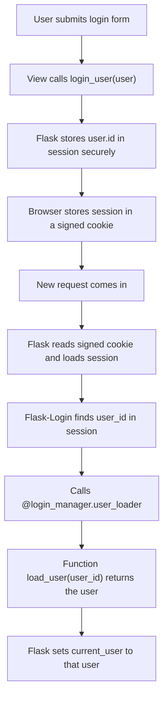

# Imago English v2  

A modular Flask-based language learning app designed to help students build vocabulary using flashcards, study streak tracking, text-to-speech, and an interactive audiobook feature. This is a rewrite of the original Imago English app, structured for clarity and maintainability.


**TL;DR:** Flask + SQLAlchemy + Google APIs + modular blueprints.  
Core features: flashcards, spaced repetition, admin/teacher/student dashboards, Google Calendar sync, built in E-reader with Google Translate and flashcard creation.

---

## ✅ Features (Planned and Implemented)

- ✅ Modular Flask blueprint architecture
- ✅ User authentication module (auth blueprint)
- ✅ Initial route test (`/auth/test`)
- ✅ User model  
  - ✅ Role-based access: `student`, `teacher`, `@dmin!`
  - ✅ Self-referencing relationship for teacher assignment
  - ✅ Integrated with Flask-Login (via `UserMixin`)
  - ✅ Overrides `is_active` based on DB value
  - ✅ Documented in `docs/architecture.md`
- ✅ Flashcard creation and study flow
- ✅ Admin dashboard  
  - ✅ Routes: Assign students, Unassign students, Change roles, Hard delete, Activate/Deactivate user  
  - ✅ Dashboard
- ✅ Teacher features  
  - ✅ Dashboard with private information and assigned_students list  
  - ✅ `manage_student_flashcards.html`  
  - ✅ Test student flashcards management routes (edit / delete / add)  
  - ✅ Adds form for adding card for student  
  - ✅ Creates search button within `manage_student_flashcards` (added to edit_cards also)  
  - ✅ Student level (A1 to C1), for later implementation of audiobooks and activities
- ✅ Audiobook reader (with dictionary and flashcard addition)
- ✅ Progress tracking  
  - ✅ Leaderboard table with ranking and top three ever
- ✅ Google Calendar integration (for teacher availability)
- ✅ Google Translate integration
- ✅ Google Login integration
- ⏭️ NEXT: Stripe integration

---


## How to run the app

### Option 1 (Default)
#### 1. Clone and set up the environment:
```bash
git clone https://github.com/vmathm/imago-english-v2.git
cd imago-english-v2
python3 -m venv venv
source venv/bin/activate   
pip install -r requirements.txt
```

#### 2. Create a `.env` file in the project root:
```env

SECRET_KEY=your-secret-key
ALLOW_SEEDED_USERS=True  #False for production
```
Optional: 
add DATABASE_URL=sqlite:///app.db= your_database.db to .env


#### 3. Create a `.flaskenv` file in the project root:
```flaskenv

FLASK_APP=main.py
FLASK_DEBUG=1    #0 for production
```

#### 4. Run the app
```bash
flask run
``` 


### Option 2 - Run with Docker (no need to setup virtual environment) 

#### 1. Clone the project:
```bash
git clone https://github.com/vmathm/imago-english-v2.git
```
#### 2. Create a `.env` file in the project root:
```env

SECRET_KEY=your-secret-key
ALLOW_SEEDED_USERS=True
```
Optional: 
add DATABASE_URL=sqlite:///app.db= your_database.db to .env


#### 3. Build the image:
`docker compose up --build`

This will: 
* Build the image
* Start the Flask app on http://localhost:5000
* Mount code (.:/app) for live reloads
* Persist SQLite database inside a named volume (db_data)


## Project Start Date

June 12, 2025


## Flask-Login Authentication & Session Flow


Now in any route:
    🔹 current_user is available
    🔹 protect views with `@login_required`


## Form Handling
This app uses **Flask-WTF** for secure and structured form handling.

* Blueprints that use Flask-WTF (forms are at given_blueprint/form.py): admin, calendar and flashcard.
 
Inherits from: FlaskForm

This enables:

- automatic CSRF protection

- built-in form validation

- integration with Jinja templates

More on **CSFR Protection** at docs/frontend.md

## Folder Structure
Refer to docs/architecture.md ## Project Structure

## Google Calendar Integration

Allows teachers to publish their availability through Google Calendar.  
- teachers manage their own time window.
- Students see a list of free slots. 
- 
### 1. Prerequisites
1. Enable the **Google Calendar API** in a Google Cloud project.
2. Create a **service account** and download its JSON credentials.
3. Set the environment variable in `.env`:

### 2. Model
The `CalendarSettings` model stores each teacher’s preferences for availability and lesson duration, outputing a personalized calendar based on their Google Calendar availability. 

### 3. Routes
Refer to the Calendar section of `documents/api.md`


### 4. How it works
`app/services/google_calendar.get_teacher_availability()`:
1. Uses the service-account credentials to query Google Calendar for busy blocks.
2. Applies the teacher’s `CalendarSettings.
3. Generates slots and removes any overlapping busy periods.
4. Returns a dictionary keyed by date, each containing a list of free time ranges.

### 5. Sharing
After saving settings, a copyable link is displayed on the settings page: /calendar 
<teacher_user_name>
Share this URL with students so they can select an available time.

### 6. Dependencies
The feature relies on the following packages (already listed in `requirements.txt`):
- `google-api-python-client`
- `google-auth`
- `google-auth-oauthlib`
- `python-dateutil`


## Google Translate API

This project integrates with the [Google Cloud Translate API](https://cloud.google.com/translate) to provide English-to-Portuguese translation.

- The prerequisites for this API are similar to Google Calendar. 

- The logic is implemented in [`services/translate.py`](./app/services/translate.py).

See [`docs/api.md`](./docs/api.md) for request/response details on the `/audiobook/translate` endpoint.


## Google Login Integration
Allows users to authenticate using their Google account via OAuth 2.0, handled by Flask-Dance.

- New users are automatically created on first login.

- Existing users are matched by email and logged in.

- Sessions are managed using Flask-Login.

### 1. Prerequisites:
- Enable the Google OAuth 2.0 API in a Google Cloud project.

- Create OAuth 2.0 Client Credentials for a Web App.

- Add an Authorized redirect URI in Google Console:
`http://127.0.0.1:5000/auth/login/google/complete`

Add the following to  .env file:

```
GOOGLE_OAUTH_CLIENT_ID=your-client-id.apps.googleusercontent.com
GOOGLE_OAUTH_CLIENT_SECRET=your-client-secret
OAUTHLIB_INSECURE_TRANSPORT=1  # Only for development
```

### 2. Logic & Flow:
- `auth/routes.py` registers the Flask-Dance Google blueprint (google_bp).

- `auth/login/google/complete` receives the final redirect from Google.

- `User info is retrieved` via the Google People API.

- The user is logged in or created, and redirected to `/dashboard`.

### 3. Routes:
- `GET /auth/login/google` – starts the login flow (optional wrapper)

- `GET /login/google` – internal Flask-Dance route to Google OAuth

- `GET /auth/login/google/complete` – final login logic after Google redirects back

- Refer to docs/api.md for full details.

### 4. Dependencies
- flask-dance[google]

- flask-login